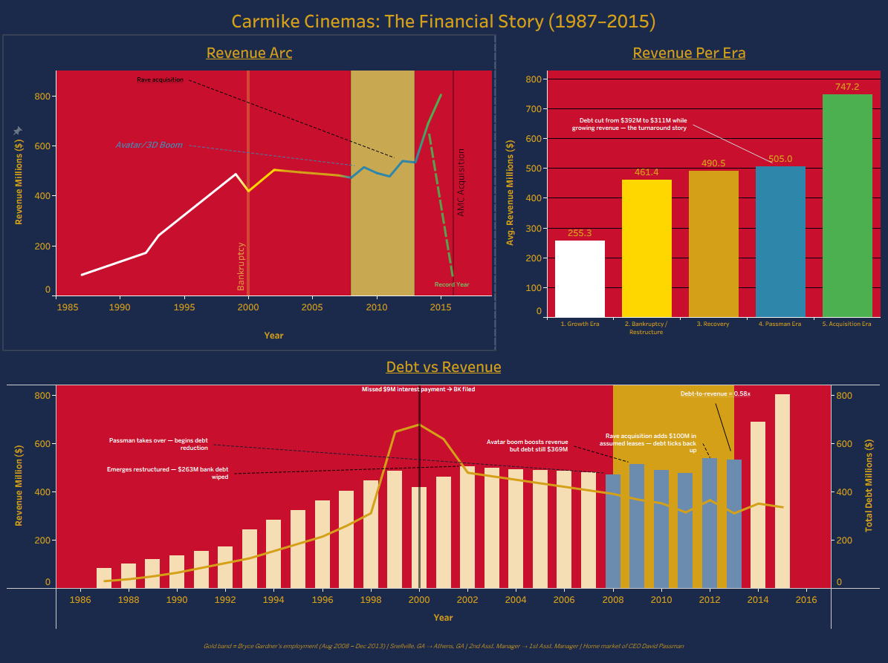
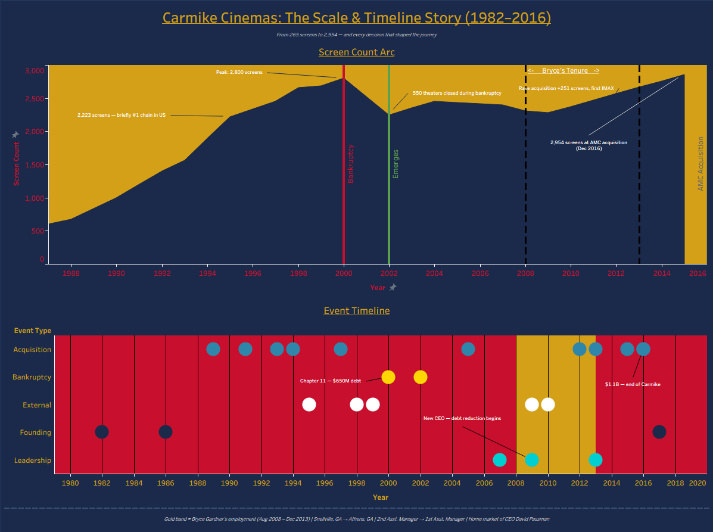

# 🎬 Carmike Cinemas: Rise, Fall & Acquisition (1982–2016)
### Business Analysis Series — Project 1 of 3 | Tools: Python · SQLite · Tableau

A business analyst's deep dive into the full lifecycle of Carmike Cinemas — from a $25 million leveraged buyout of a small Georgia theater chain in 1982 to a $1.1 billion acquisition by AMC in 2016. This project examines how a company can grow aggressively, survive bankruptcy, stage a remarkable operational recovery, and still end up absorbed — and why debt, not revenue, was always the real story.

**Personal note:** I worked at Carmike Cinemas from August 2008 to December 2013, first as a 2nd Assistant Manager at the Snellville, GA location — the home market of CEO David Passman, whom I met several times — and later as a 1st Assistant Manager in Athens, GA. That window sits directly in the Passman era, the most operationally disciplined period in the company's post-bankruptcy history. This project is my attempt to understand, with data, the company I worked for.

---

## Tools Used
| Tool | Purpose |
|---|---|
| Python (pandas) | Data collection, cleaning, interpolation |
| SQLite | Database storage and structured querying |
| DB Browser for SQLite | SQL query interface |
| Tableau Public | Interactive dashboards and visualizations |
| SEC EDGAR | Primary financial data source (10-K and 8-K filings) |
| FundingUniverse / Encyclopedia.com | Historical company data (pre-public era) |

---

## The Story

### The Question
Carmike Cinemas was headquartered in Columbus, Georgia — not Hollywood, not New York. It was a Southern chain that grew by targeting small and mid-sized markets nobody else wanted. At its peak it operated 2,800 screens across 448 theaters and was briefly the largest cinema chain in the United States by screen count. Then it went bankrupt. Then it came back. Then it got bought.

The question this project asks is simple: **was Carmike's failure inevitable, or did it have a real chance?**

The data says both things are true at once.

---

## Data Sources & Methodology

Financial data was sourced primarily from SEC EDGAR filings — 10-K annual reports and 8-K earnings releases — for all confirmed years from 2007 onward. Pre-2007 data was sourced from company history archives and encyclopedia references. Years with no available data were filled using **linear interpolation between confirmed anchor points**, flagged with a `data_quality` column value of `'estimated'`. All confirmed data points retain their original source citations in the database.

The 2000 bankruptcy year received a deliberate 15% revenue haircut rather than straight interpolation, reflecting the documented attendance collapse during Chapter 11 proceedings. Debt estimates for 1987–1997 were constructed from known interest expense figures, acquisition timelines, and the confirmed 1998 SEC balance sheet figure of $311.9M.

---

## Database Structure

Four tables, built in SQLite:

| Table | Description |
|-------|-------------|
| `annual_financials` | Revenue, net income, total debt (1987–2016) with data quality flags |
| `theater_scale` | Theater and screen count (1982–2016) |
| `key_events` | 24 annotated company events — acquisitions, bankruptcies, leadership changes |
| `bryce_employment` | Personal employment record with month-level precision |

---

## SQL Highlights

**Revenue during employment window:**
```sql
SELECT year, revenue_mil, net_income_mil, total_debt_mil
FROM annual_financials
WHERE year BETWEEN 2008 AND 2013
ORDER BY year;
```

**Debt-to-revenue ratio by year:**
```sql
SELECT year, revenue_mil, total_debt_mil,
       ROUND(CAST(total_debt_mil AS REAL) / revenue_mil, 3) AS debt_to_revenue_ratio
FROM annual_financials
WHERE total_debt_mil IS NOT NULL
ORDER BY year;
```

**Revenue efficiency per screen:**
```sql
SELECT f.year, f.revenue_mil, t.screen_count,
       ROUND(f.revenue_mil * 1000000 / t.screen_count, 0) AS rev_per_screen
FROM annual_financials f
JOIN theater_scale t ON f.year = t.year
ORDER BY f.year;
```

**Key events during employment:**
```sql
SELECT year, event_label, event_type
FROM key_events
WHERE year BETWEEN 2008 AND 2013
ORDER BY year;
```

---

## Dashboards

### Dashboard 1 — The Financial Story (1987–2015)
*Revenue growth masked a debt crisis decades in the making*

[](https://public.tableau.com/app/profile/bryce.gardner/viz/CarmikeCinemas/CarmikeCinemasRiseFallAcquisition)

Three charts tell the financial story together:

**Revenue Arc** traces the full revenue journey from $84M in 1987 to a record $804.4M in 2015 — colored by company era, annotated with the Avatar/3D boom (2009), the Rave acquisition (2012), and the record year before AMC closed in. The gold band marks Bryce's tenure.

**Revenue Per Era** gives a clean average revenue comparison across all five eras — showing the Acquisition Era posted the highest average revenue ($747M) right before the company ceased to exist independently. The company was performing at its best when it got bought.

**Debt vs Revenue** is the smoking gun. Revenue grew steadily for 30 years. Debt grew faster — peaking at $680M in 2000 when Carmike missed a $9M interest payment and filed Chapter 11. Passman spent 7 years methodically reducing that ratio from 0.83x in 2008 to 0.58x by 2013. But the legacy of 1999's $275M debt binge never fully went away.

---

### Dashboard 2 — The Scale & Timeline Story (1982–2016)
*From 265 screens to 2,954 — and every decision that shaped the journey*

[](https://public.tableau.com/app/profile/bryce.gardner/viz/CarmikeCinemas/CarmikeCinemasRiseFallAcquisition)

**Screen Count Arc** tells the expansion story visually — 265 screens at founding, 2,800 at the 2000 peak, a hard crash to 2,250 screens during bankruptcy restructuring, a slow rebuild, then 2,954 screens at the moment of AMC acquisition. The shape of the area chart alone tells the whole story.

**Event Timeline** maps all 24 key company events across five categories — acquisitions, bankruptcies, external events, leadership changes, and founding moments — as a dot plot. The acquisition binge of 1989–1997 is immediately visible as a cluster of dots. The Passman era (2009–2016) has almost no acquisition dots — pure operational discipline. Then a single large dot at 2016: AMC buys everything.

---

## Key Findings

- **Debt was always the story, not revenue.** Carmike grew revenue every decade. The 1999 decision to issue $200M in Senior Subordinated Notes plus a $75M Term Loan — doubling debt in a single year — made bankruptcy mathematically inevitable within 18 months.

- **The Passman era was genuinely impressive.** From 2009 to 2013, Passman reduced the debt-to-revenue ratio from 0.83x to 0.58x while growing average annual revenue. The 2013 Ernst & Young Entrepreneur of the Year award for the Southeast wasn't undeserved.

- **The company peaked right before it ended.** 2015 revenue of $804.4M was the all-time record. The Acquisition Era average of $747M per year was the highest of any era. AMC didn't buy a failing company — they bought a recovered one at a premium.

- **The small-market strategy had a ceiling.** Carmike's original edge — going where nobody else went — became a liability as streaming and premium formats (IMAX, recliner seating, dine-in) required capital investment their debt load couldn't support.

- **Bryce's window (2008–2013) was the turnaround.** The years I worked there were the most operationally disciplined in the company's post-bankruptcy history. Revenue held steady, debt declined, and the Rave acquisition added premium capability for the first time.

---

## What I Learned (As an Analyst)

Working at Carmike during the Passman era, I saw firsthand that the theaters were well-run operationally — tight staffing, strong concession focus, consistent customer experience standards. What wasn't visible from the theater floor was the debt ceiling that made long-term independence impossible regardless of operational performance.

This project taught me that **business failure is rarely about operations**. It's almost always about capital structure decisions made years earlier. The people running Carmike's theaters in 2013 were doing everything right. The people who issued $200M in junk bonds in 1999 had already made the outcome inevitable.

---

## Files in This Repository

| File | Description |
|------|-------------|
| `carmike_cinemas.db` | SQLite database — all four tables |
| `build_database.py` | Python script to build and populate the database |
| `export_csvs.py` | Python script to export Tableau-ready CSVs |
| `interpolate_gaps.py` | Python script for linear interpolation of data gaps |
| `analysis_queries.py` | Full SQL analysis query pack |
| `csv/` | Six Tableau-ready CSV exports |
| `screenshots/` | Dashboard screenshots |

---

## Portfolio Navigation

| # | Project | Tools | Focus |
|---|---------|-------|-------|
| **Business Analysis Series** | | | |
| 1 | 🎬 Carmike Cinemas *(this project)* | Python · SQLite · Tableau | Cinema industry — rise, bankruptcy & acquisition |
| 2 | 🌮 [On The Border](https://github.com/brycegardner90/on-the-border-analysis) | Python · SQLite · Tableau | Casual dining — PE ownership & brand decline |
| 3 | 🍹 [Kona Grill](https://github.com/brycegardner90/kona-grill-analysis) | Python · SQLite · Tableau | Upscale casual — overexpansion, bankruptcy & recovery |
| **Original Portfolio** | | | |
| 1 | 🎮 [Video Game Sales Analysis](https://github.com/brycegardner90/video-game-sales-analysis) | SQL · Power BI | Sales trends & publisher performance |
| 2 | 🏈 [NFL Penalty Bias Analysis](https://github.com/brycegardner90/nfl-penalty-analysis) | SQL · Power BI | Referee bias & penalty patterns |
| 3 | 🏙️ [Atlanta Rising](https://github.com/brycegardner90/Atlanta-Rising-A-Century-of-Growth) | Python · SQLite · Power BI | A century of Atlanta growth |
| 4 | 🍽️ [Four Tiers, One Century](https://github.com/brycegardner90/restaurant-industry-analysis) | Python · SQLite · Tableau | Restaurant industry analysis |
| 5 | 🏘️ [The Forsyth Boom](https://github.com/brycegardner90/Forsyth-Boom) | Python · SQLite · Tableau | Small business & population growth |
| **Public Health Series** | | | |
| 1 | 🧠 [ADHD in America](https://github.com/brycegardner90/adhd-in-america) | Python · SQLite · Power BI | 25-year ADHD trends |
| 2 | 💊 [The Opioid Crisis](https://github.com/brycegardner90/opioid-crisis-analysis) | Python · SQLite · Power BI | Opioid mortality analysis |
| 3 | 🏥 [Mental Health in America](https://github.com/brycegardner90/mental-health-trends) | Python · SQLite · Power BI | Mental health trends & treatment gaps |

---

*Built by Bryce Gardner · [LinkedIn](https://www.linkedin.com/in/bryce-gardner-16a889183) · [GitHub](https://github.com/brycegardner90)*
